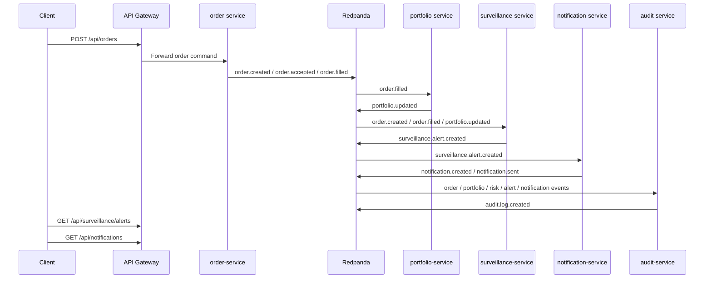

# Event Flow Reference

TradeOps uses Redpanda/Kafka for cross-service domain events and Mosquitto/MQTT for raw market tick ingestion.

Events should include `correlationId` when available. API Gateway accepts or generates `X-Correlation-ID`, services propagate it to Kafka events, consumers preserve it in downstream events and DLQ records, and audit-service stores it in `audit_logs.correlation_id`.

## Topic Map

| Topic | Producer | Consumers | Purpose |
| --- | --- | --- | --- |
| `user.registered` | `identity-service` | `audit-service` | User registration audit event. |
| `user.login` | `identity-service` | `audit-service` | User login audit event. |
| `user.logout` | `identity-service` | `audit-service` | User logout audit event. |
| `market.ticks` | `market-data-service` | `surveillance-service` | Normalized market tick events. |
| `order.created` | `order-service` | `surveillance-service`, `audit-service` | Order submitted/created event. |
| `order.validated` | `order-service` | None currently | Order validation lifecycle event. |
| `order.accepted` | `order-service` | None currently | Accepted order lifecycle event. |
| `order.filled` | `order-service` | `portfolio-service`, `surveillance-service`, `audit-service` | Filled order event. |
| `order.rejected` | `order-service` | None currently | Rejected order lifecycle event. |
| `order.cancelled` | `order-service` | `surveillance-service`, `audit-service` | Cancelled order event. |
| `portfolio.updated` | `portfolio-service` | `surveillance-service`, `audit-service` | Holdings/cash update event. |
| `portfolio.snapshot.created` | `portfolio-service` | None currently | Portfolio snapshot event. |
| `strategy.signal.generated` | `strategy-service` | `surveillance-service` | Strategy signal event. |
| `strategy.backtest.completed` | `strategy-service` | None currently | Backtest completion event. |
| `risk.score.updated` | `risk-engine-service` | `surveillance-service`, `audit-service` | Risk score update event. |
| `risk.breached` | `risk-engine-service` | `audit-service` | Risk threshold breach event. |
| `risk.anomaly.detected` | `risk-engine-service` | None currently | Risk anomaly event. |
| `surveillance.alert.created` | `surveillance-service` | `notification-service`, `audit-service` | New surveillance alert event. |
| `surveillance.alert.acknowledged` | `surveillance-service` | `notification-service`, `audit-service` | Alert acknowledged event. |
| `surveillance.alert.resolved` | `surveillance-service` | `notification-service`, `audit-service` | Alert resolved event. |
| `surveillance.alert.dismissed` | `surveillance-service` | `notification-service`, `audit-service` | Alert dismissed event. |
| `notification.created` | `notification-service` | None currently | Notification created event. |
| `notification.sent` | `notification-service` | `audit-service` | Notification delivery success event. |
| `notification.failed` | `notification-service` | `audit-service` | Notification delivery failure event. |
| `notification.read` | `notification-service` | `audit-service` | Notification marked read event. |
| `notification.retry_requested` | `notification-service` | `audit-service` | Notification retry requested event. |
| `audit.log.created` | `audit-service` | None currently | Audit log created event. |

## End-To-End Event Story

## Demo Payloads

- Surveillance payloads live under `docs/examples/surveillance/`.
- Notification payloads live under `docs/examples/notifications/`.
- Audit payloads live under `docs/examples/audit/`.
- Demo scripts publish compact JSON to Redpanda with `rpk topic produce`.
- Replay/demo scripts accept `CORRELATION_ID` to inject a traceable `correlationId`.

## Current Limitations

- Event schemas are documented by example payloads, not enforced by schema registry.
- Some published topics are intentionally not consumed yet.
- `portfolio.updated` and `strategy.signal.generated` are consumed by surveillance, but not all consumed events currently trigger rules.
- Notification lifecycle events are consumed by audit-service for compliance-style traceability.
