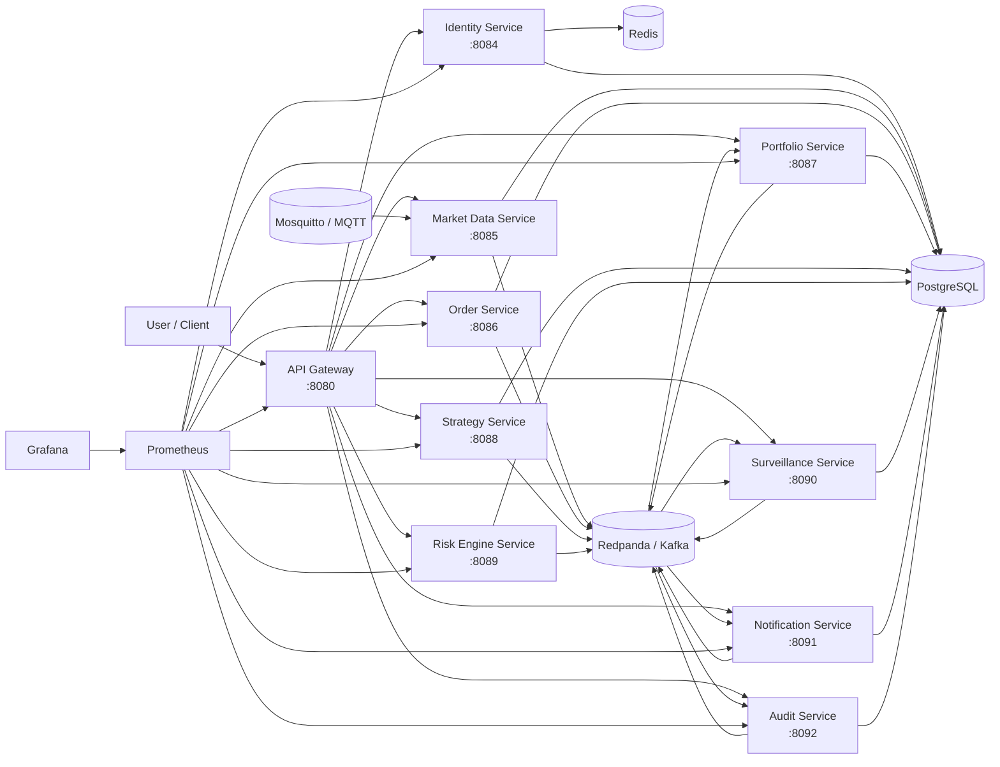
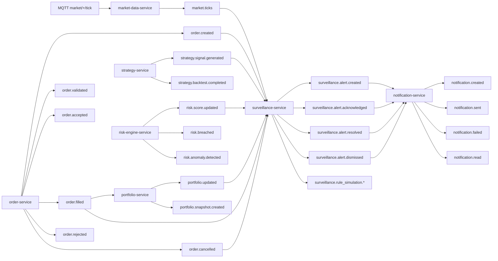

# TradeOps Architecture Overview

TradeOps Intelligence Platform is a local, enterprise-style trading intelligence system built from small services. It demonstrates authentication, API Gateway hardening, market data ingestion, order flow, portfolio updates, strategy/risk analytics, surveillance alerts, notifications, audit trails, real-time WebSocket streaming, correlation visibility, observability, and Docker Compose operations.

The platform is designed for portfolio and interview demonstration. It is not yet a real production deployment, but the service boundaries, messaging patterns, health checks, metrics, and runbooks mirror production concerns.

v2.2.0 adds shared-database multitenancy. Tenant-owned tables use `tenant_id`, JWTs include `tenantId`, API Gateway propagates `X-Tenant-ID`, events include `tenantId`, audit logs store tenant context, and WebSocket streams filter tenant events by connection tenant.

v2.3.0 adds OpenTelemetry tracing for the primary API Gateway -> order -> surveillance -> notification -> audit path. W3C `traceparent` and `tracestate` headers flow over HTTP, while Kafka events preserve `correlationId` and include `traceparent` where practical.

v2.5.0 adds lightweight event schema governance. Core Kafka/Redpanda topics, DLQ payloads, and WebSocket stream messages now have versioned JSON Schemas under `schemas/events/`, with optional envelope metadata for `eventVersion`, `tenantId`, `correlationId`, and `traceparent`.

v2.7.0 adds API Gateway admin operations APIs under `/api/admin` for service health, service/topic catalogs, DLQ guidance, audit/alert/notification/rule summaries, and safe platform config views without adding a frontend UI.

v2.8.0 adds advanced risk analytics: stress testing, named scenario analysis, concentration risk, drawdown trends, volatility shocks, and explainable recommendations.

v2.9.0 upgrades the React dashboard placeholder into a lightweight real-time dashboard for admin summaries, WebSocket events, risk analytics demos, and observability links.

## Service List

| Service | Purpose |
| --- | --- |
| `api-gateway` | Single external HTTP entry point, reverse proxy to backend services, WebSocket streaming host, and admin operations API surface. |
| `identity-service` | Registration, login, JWT issuance, refresh tokens, and RBAC identity data. |
| `market-data-service` | MQTT market tick ingestion, validation, storage, and Kafka publication. |
| `order-service` | Order creation, validation, idempotency, status transitions, and order events. |
| `portfolio-service` | Consumes fills, updates holdings/cash, and publishes portfolio snapshots. |
| `strategy-service` | Strategy CRUD, backtests, performance, generated signals, and strategy events. |
| `risk-engine-service` | Portfolio risk score, VaR, volatility, drawdown, stress testing, scenario analysis, concentration risk, recommendations, and risk events. |
| `surveillance-service` | Consumes trading/risk/market events, supports dry-run rule simulation, and creates alert lifecycle events in live processing. |
| `notification-service` | Consumes surveillance alert events, creates notifications, and records delivery attempts. |
| `audit-service` | Consumes platform events, stores searchable audit logs, and exposes summary/export APIs. |

## Technology Stack

| Layer | Technology |
| --- | --- |
| Gateway | Node.js, Express, Jest |
| Go services | Go, Chi, pgx, kafka-go, Prometheus client |
| Python services | FastAPI, SQLAlchemy, psycopg, confluent-kafka, Prometheus client |
| Data | PostgreSQL, Redis |
| Messaging | Redpanda/Kafka, Mosquitto/MQTT |
| Event contracts | JSON Schema, event catalog, compatibility rules |
| Observability | Prometheus, Grafana, Jaeger, OpenTelemetry, alert rules, SLO docs, structured logs, correlation IDs |
| Runtime | Docker Compose, optional Helm/Kubernetes deployment-readiness chart |

## High-Level Architecture

## Request Flow

1. A client sends HTTP requests to the API Gateway.
2. Public auth endpoints are proxied to `identity-service`.
3. Protected service APIs require a JWT issued by identity.
4. The gateway forwards authorization, tenant, and correlation headers to the target service.
5. Services validate JWT/RBAC locally, use PostgreSQL for service data, and return JSON responses.
6. Long-running side effects are represented as Kafka events when applicable.

## Real-Time Streaming Flow

- The API Gateway exposes `/ws`, `/ws/market`, `/ws/orders`, `/ws/alerts`, `/ws/notifications`, and `/ws/audit`.
- WebSocket clients authenticate with a JWT query token or upgrade `Authorization` header when `WS_REQUIRE_AUTH=true`.
- The gateway consumes selected Redpanda/Kafka topics and broadcasts normalized messages with `type`, `topic`, `correlationId`, `timestamp`, and `payload`.
- Heartbeats keep local clients aware of connection health.

## Event-Driven Flow

## Observability Flow

- Each service exposes `/health`, `/ready`, and `/metrics`.
- The API Gateway also proxies major service health, readiness, and metrics routes where supported.
- Prometheus scrapes gateway and service metrics over the Docker Compose network.
- Grafana reads Prometheus and includes dashboards for platform overview, API Gateway, event processing, surveillance/notifications, and audit/compliance.
- Prometheus loads local alert rules for service availability, gateway failures/latency, event processing failures, DLQ events, notification delivery failures, and audit ingestion failures.
- SLO-oriented docs live under `docs/observability/` and describe demo SLIs, dashboard usage, alert behavior, and runbook steps.
- Correlation IDs flow through the gateway to help trace requests across services.
- `X-Correlation-ID` is the standard HTTP header, `correlationId` is the standard event/log field, and audit logs persist it as `correlation_id`.
- This release intentionally uses lightweight correlation tracing rather than Jaeger, Tempo, OpenTelemetry Collector, or Loki.

## Deployment Readiness

- Docker Compose remains the primary local runtime and demo path.
- The optional Helm chart under `infrastructure/helm/tradeops-platform/` renders Kubernetes Deployments and Services for application services.
- Kubernetes config separates non-secret values in a ConfigMap from placeholder secret values in a Secret.
- Application pods include `/health` liveness probes, `/ready` readiness probes, resource requests/limits, and `terminationGracePeriodSeconds: 30`.
- Stateful infrastructure such as PostgreSQL, Redis, Redpanda, Mosquitto, Prometheus, and Grafana is expected to be managed separately for Kubernetes deployments.

## Security Flow

- Users register and login through `/api/auth`.
- `identity-service` issues JWT access tokens.
- Services verify JWT signatures using the shared local identity secret configured in Compose.
- Services enforce role-based access where implemented.
- The API Gateway applies Helmet headers, configurable CORS, request body limits, rate limiting, proxy timeout handling, and consistent error responses with `correlationId`.
- Secrets are provided through `infrastructure/docker/.env` and should not be committed.
- Security docs cover the [threat model](../security/threat-model.md), [RBAC matrix](../security/rbac-matrix.md), [API security](../security/api-security.md), [secrets management](../security/secrets-management.md), and [security checklist](../security/security-checklist.md).

## Database Usage

- PostgreSQL is the primary store for identity, market, order, portfolio, strategy, risk, surveillance, and notification data.
- `audit-service` stores normalized audit logs and export request records in PostgreSQL.
- Services own their tables and run their own startup migrations.
- Redis is used by identity for refresh-token/session-oriented state.
- The current local Compose deployment uses one PostgreSQL database for convenience; stronger isolation would be expected in a production deployment.

## Messaging Usage

- Mosquitto receives raw/simulated market ticks.
- `market-data-service` normalizes MQTT ticks and publishes `market.ticks`.
- Redpanda/Kafka connects order, portfolio, strategy, risk, surveillance, and notification flows.
- Bad payload handling is intentionally defensive in event consumers so malformed demo messages do not crash services.
- Versioned event schemas live under `schemas/events/`; see [event catalog](../events/event-catalog.md) and [schema governance](../events/schema-governance.md).
- Event producers should add `eventType`, `eventVersion`, `tenantId`, `correlationId`, and `traceparent` additively where practical.
