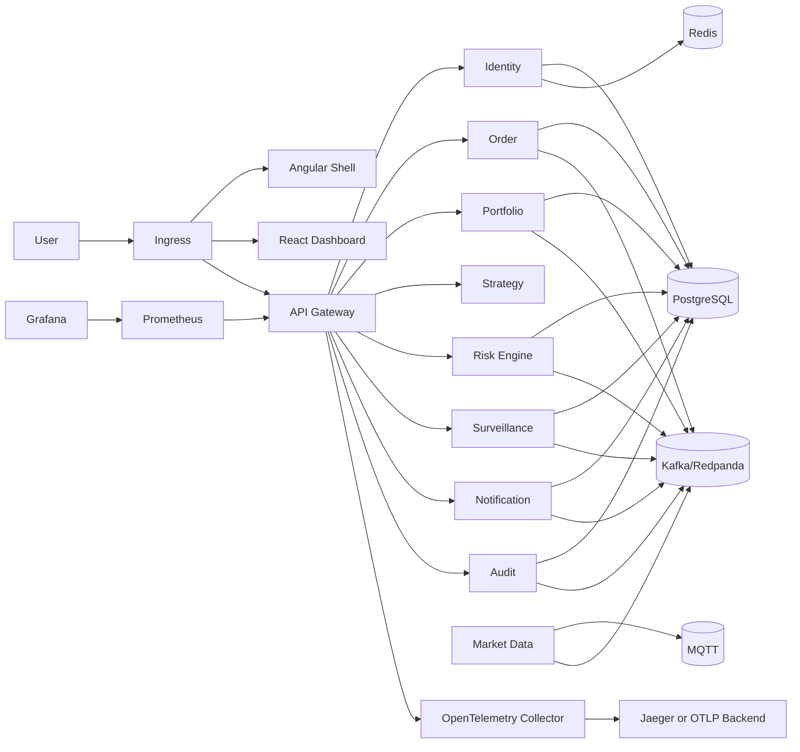
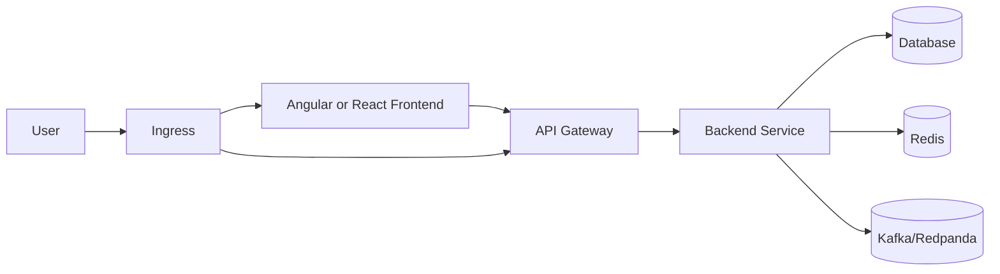
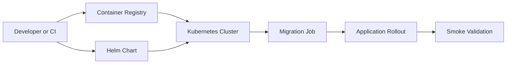

# Kubernetes Deployment Overview

TradeOps v3.0.0 adds a cloud-neutral Kubernetes blueprint centered on the Helm chart in `deployments/helm/tradeops`.

Local values can deploy demo PostgreSQL, Redis, Redpanda, and Mosquitto. Staging and production values prefer externally managed dependencies.

Known production ownership remains outside the chart: sizing, DNS, TLS issuance, credential lifecycle, backup policies, image registry replication, and incident response.

## Request Flow

## Deployment Flow

