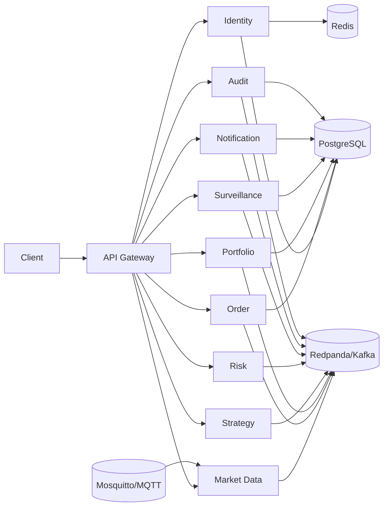
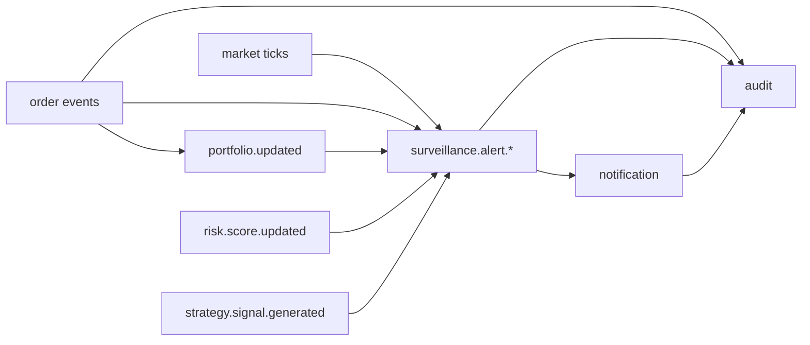
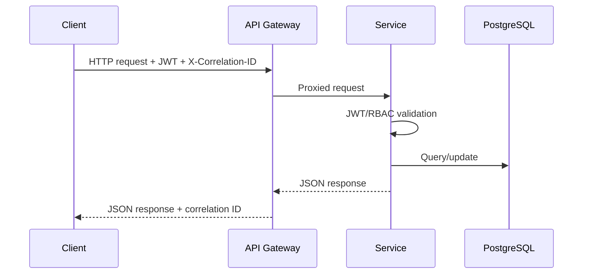
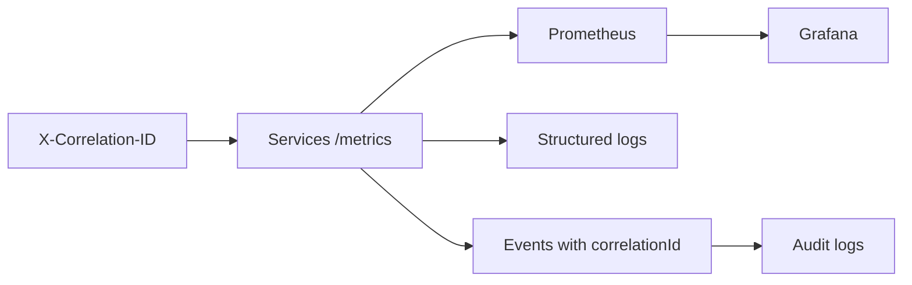
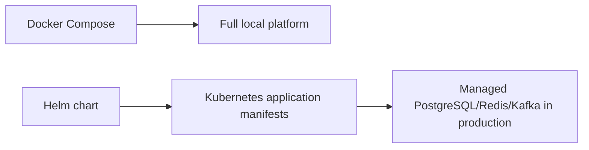

# Architecture Summary

## High-Level Architecture

The gateway provides the external HTTP boundary. Services own domain logic and data while Kafka handles asynchronous workflows.

## Event Flow

Events let services evolve independently and make replay/DLQ workflows possible.

## Request Flow

Synchronous APIs are used for commands and queries; events carry side effects and integration signals.

## Observability Flow

Metrics, logs, events, and audit records share correlation identifiers for lightweight tracing.

## Deployment Flow

Docker Compose is the primary runnable demo. Helm is an optional deployment-readiness layer for explaining Kubernetes packaging.
